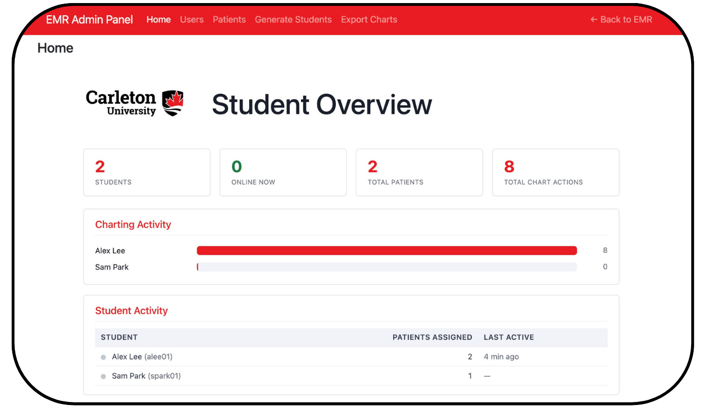
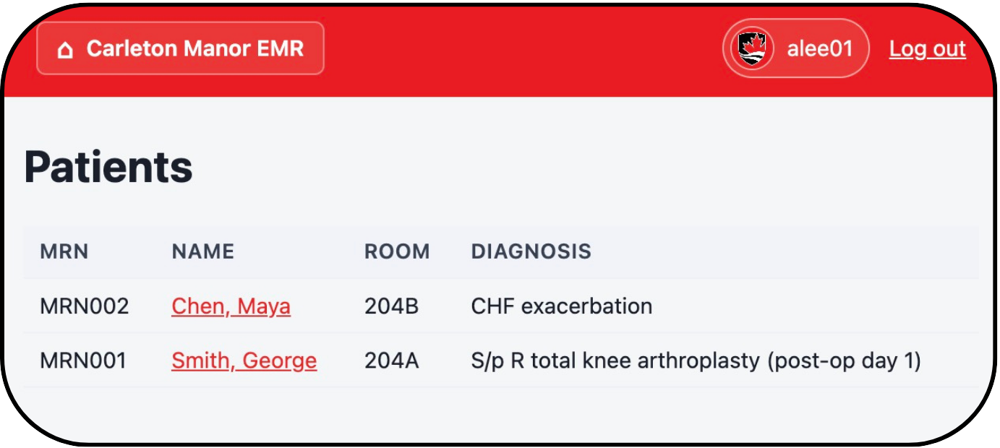
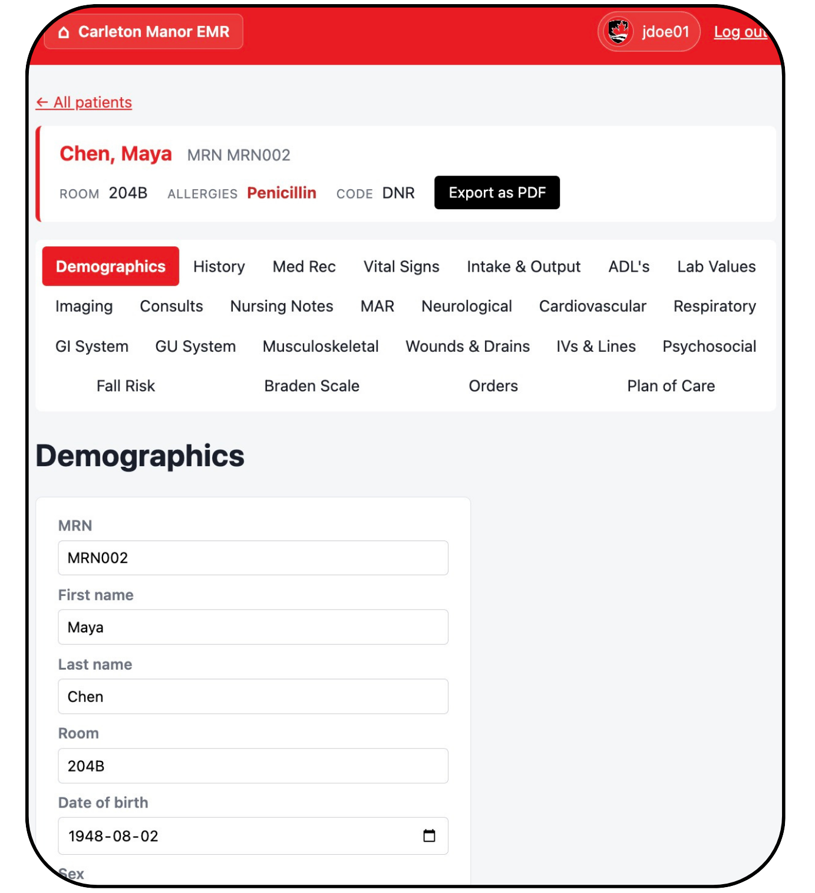
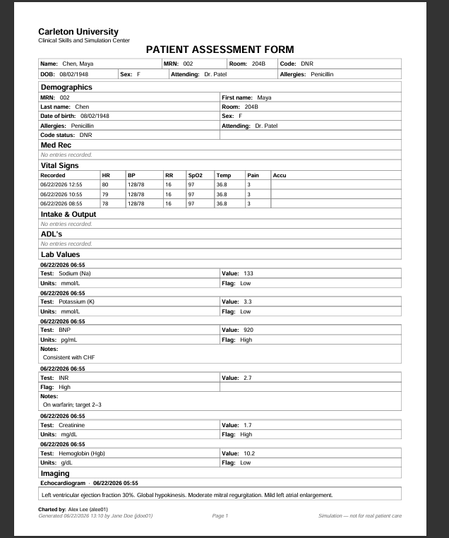

# Carleton Manor EMR

A full-stack clinical Electronic Medical Record (EMR) web application built for Carleton University's nursing simulation lab, where nursing students practice charting on simulated patients and instructors oversee their work.

> **Note:** This is a case-study repository. The application source code is kept private at the request of the project stakeholders, so this repo documents the work, design, and outcomes rather than hosting the code. A live demo is available on request.

**Status:** In active use at Carleton University's nursing simulation lab

**Portfolio:** [al-howaid.me](https://al-howaid.me)

---

---

## Summary (STAR)

**Situation.** Carleton University's nursing simulation lab needed an electronic medical record system where students could practice charting on simulated patients, but had no purpose-built tool for it.

**Task.** Build a full-stack web application that lets students chart across realistic assessment sections while giving instructors oversight of student work, all secure, reliable, and usable in an active classroom.

**Action.** I built the app in Python and Flask backed by a PostgreSQL database. I implemented role-based access control, and session authentication, then developed an instructor admin panel with real-time student activity tracking and a bulk PDF chart-export feature. I engineered a multi-page PDF generation engine that renders full patient assessments from live charting data, and coordinated with faculty to match any requested requirements and features, running ongoing testing and QA.

**Result.** A working EMR now used by Carleton nursing students and instructors in an active university environment.

---

## Tech Stack

| Layer | Tools |
|-------|-------|
| Backend | Python, Flask |
| Database | PostgreSQL, SQLAlchemy (ORM) |
| Admin / Auth | Flask-Admin, Flask-Login, Flask-WTF (CSRF) |
| PDF Engine | ReportLab |
| Frontend | JavaScript, HTML/CSS, Jinja2 templates |
| Tooling | Git/GitHub, VS Code |

---

## Key Features

- **24 charting sections** covering a full nursing assessment (vitals, neuro, cardiovascular, respiratory, GI/GU, MAR, wounds, and more)
- **Role-based access control** separating student and instructor permissions
- **Security**: CSRF protection on every form, session-based authentication, hashed credentials
- **Instructor dashboard** with real-time student activity, online status, and per-student charting stats
- **Bulk PDF export**: download every assigned patient's chart as a structured ZIP (student to patient to PDF)
- **Multi-page PDF engine** rendering complete assessment reports from live data, with per-page footers stamping who charted and who exported each record

---

## Behind the Scenes

### The Data Model
The system is built around a handful of related records rather than one giant table. At a high level:

- **User** is anyone who logs in, tagged as a student or an instructor.
- **Patient** is one simulated patient (demographics plus medical history).
- **Vital** holds one set of vital signs for a patient.
- **Note** is a timestamped record, where a single `kind` field covers notes, imaging, consults, and orders in one place.
- **MedOrder** is a medication order (the MAR), and **MedAdmin** tracks an individual student's scan state for that order.
- **HistoryReview** stores a student's own tick state for the history checklist.
- **ChartEntry** is one entry for the data-driven chart tabs (neuro, respiratory, and so on), with the tab identified by a `section` field.
- A link table connects patients to the students assigned to them (many-to-many).

This structure is what lets every student work the same patient independently while keeping their own charting separate, and it is what the PDF engine walks through to build a complete report.

### Screenshots

*Drop the matching image files into a `screenshots/` folder in this repo and they will appear here.*

**Instructor dashboard**

**Student dashboard**

**Patient charting page**

**Sample exported PDF**

---

## What I Learned

This was my first time taking a web application all the way from an empty repository to something people rely on weekly. A lot of the real work was in things I did not expect going in: getting the security right, being careful with user data, and making an admin panel that an instructor with no technical background could actually navigate. Working directly with faculty also showed me that the first set of requirements is rarely the final one, and the design kept changing as they used it.
